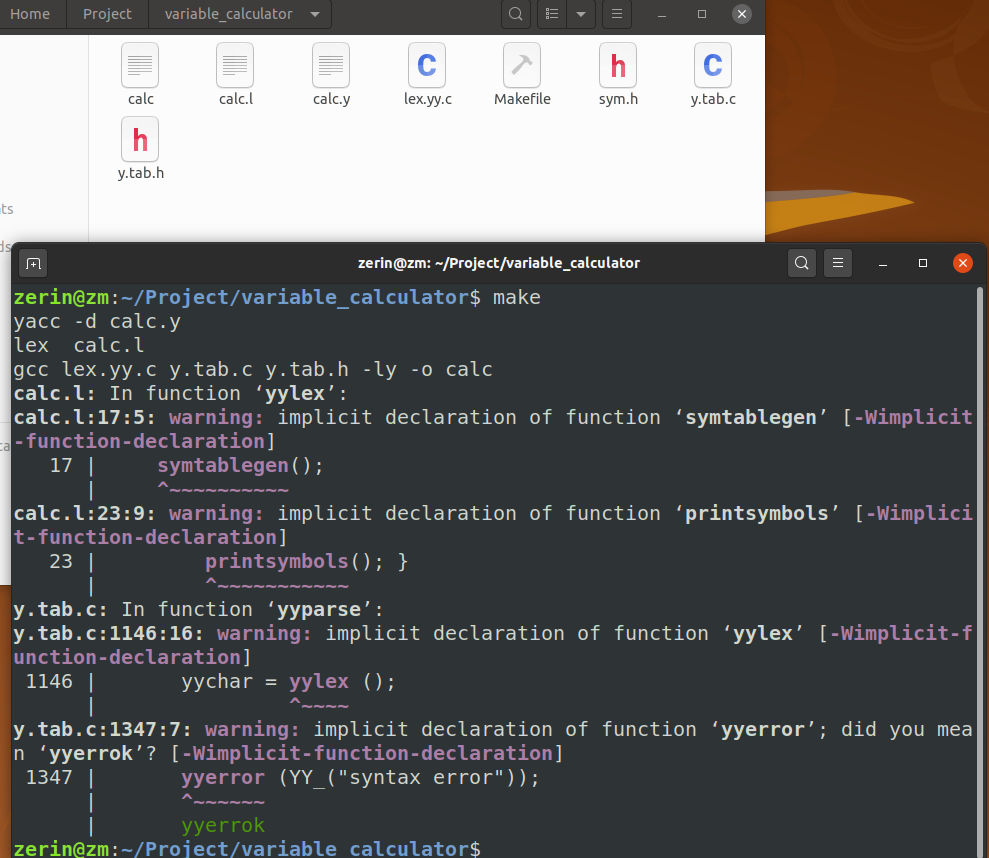
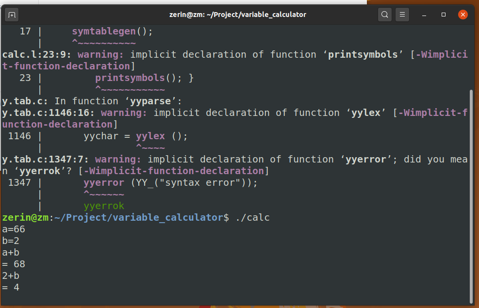
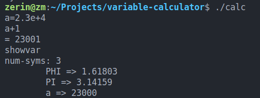

# 环境配置

```shell
    sudo apt-get install flex 

    sudo apt-get install bison 
```

# 运行

在项目文件夹中打开终端

```
make
./calc
```

# 程序思路

.l文件中正则表达式的设计
通过sym.h和.y中的函数实现变量
.y文件中规则段的设计和常量的输出展示
.y文件中变量的输出展示
makefile文件的设计

# .h文件介绍

定义一个类, 存放变量名和指向下一个变量的指针

# .l文件介绍

#### 定义段

#### 词法规则段

通过正则表达式来接收数字, 支持科学计数法  
+表示匹配1-无穷  
*表示匹配0-无穷  
反斜杠+.表示接收小数点  
?表示接收到一个就停止接收  
[ \t]忽略空格  
接收到showvar会调用函数输出当前所有变量的值

#### 辅助函数段

# .y文件介绍

#### 定义段

#### 规则段

"="为变量赋值

#### 辅助函数段

###### 1.symtablegen()函数

静态变量x为了控制第一次输出时, 将PHI和PI放入链表中

###### 2.printsymbols()函数

定义两个数组, 存放变量名和数值

两个for循环将变量排序

###### 3.sym_lookup()函数

将变量名存放到链表中, (函数外)变量值读取到"="时再存放

# 测试







